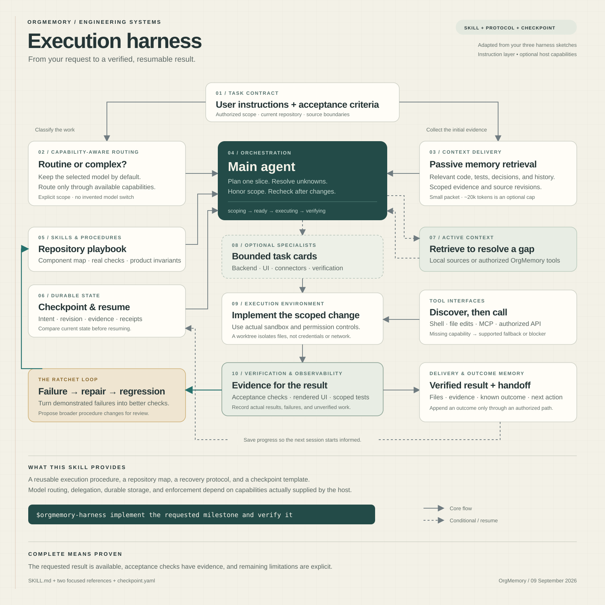

# OrgMemory execution harness

The reusable [OrgMemory harness skill](../.agents/skills/orgmemory-harness/SKILL.md) guides a coding agent through a scoped change, relevant context, implementation, verification, and a resumable handoff. It adapts all three supplied notebook designs to this repository.



## Use the skill

From the OrgMemory project, invoke:

```text
$orgmemory-harness implement the MCP preflight tools from Release 0 of
docs/STARTUP_EXECUTION_PLAN.md and verify the API and tool contracts.
```

Or resume an existing run:

```text
$orgmemory-harness resume data/harness-runs/<run-id>/checkpoint.yaml;
recheck the current repository state and finish the remaining acceptance checks.
```

The skill is kept in `.agents/skills/orgmemory-harness/`, the repository skill location described in the [official skill documentation](https://learn.chatgpt.com/docs/build-skills#where-codex-loads-local-skills). If discovery has not refreshed, open its `SKILL.md` directly and ask the agent to use it; restart the host if needed.

## Package

```text
.agents/skills/orgmemory-harness/
├── SKILL.md                        Agent instructions and execution loop
├── agents/openai.yaml              Skill name and suggested invocation
├── references/
│   ├── repository-map.md            Relevant modules, invariants, and checks
│   └── execution-protocol.md        Context, API, delegation, and recovery rules
└── assets/checkpoint.yaml           Template for resumable run state
```

The agent maintains run state under `data/harness-runs/<run-id>/`, which is already ignored by Git. The template is a state record; no background process reads it automatically. Checkpoint references should avoid secrets and raw customer data.

## How the drawings become an execution procedure

| Design element | Implementation in the skill |
|---|---|
| Instructions | A task contract records the requested outcome, authorized scope, and acceptance conditions. |
| Context delivery | A repository map directs the agent to actual handlers, schemas, callers, and tests. |
| Passive memory retrieval | The initial packet gathers relevant source evidence before an edit. |
| Active memory retrieval | A targeted lookup resolves a specific uncertainty during the task. |
| Context management | Source deduplication, compact summaries, and checkpoints preserve decisions and evidence. |
| Model routing | The agent classifies work, preserves the selected model, and uses only available, authorized routing. |
| Tool interfaces | MCP discovery or an authorized API supplies real contracts; missing tools remain explicit. |
| Execution environment | Existing sandbox permissions govern execution; isolated worktrees are used when needed. |
| Durable state | The YAML checkpoint captures revisions, checks, receipts, and the next action. |
| Orchestration | The main agent runs one coherent slice, handles retries, and integrates verification. |
| Specialists and registry | Optional scoped task cards supply inputs, ownership, dependencies, and return contracts. |
| Skills and procedures | Reusable repository checks and the execution protocol guide recurring work. |
| Verification and observability | Results identify what was checked, against which revision, and what remains unverified. |
| Ratchet loop | A demonstrated failure leads to a scoped repair and regression check; broader procedure changes are proposed. |

## Concrete example

For the request to add standalone MCP preflight tools, the skill directs the agent to inspect `mcp_server/server.py`, the existing briefing API/schema, browser registrations, and authorization tests. It then defines observable acceptance conditions: both tools are discoverable, the briefing uses the appropriate scope, its ID survives the response, and an authorized outcome can be attributed to it.

The implementation agent edits that slice, runs the relevant contract checks, records the result, and returns the changed files. If interrupted, a checkpoint identifies completed work and remaining checks. It does not automatically move on to GitHub App integration merely because that appears later in the startup plan.

## What is procedural and what requires runtime support

The delivered skill and templates are usable instructions. They do not themselves implement a new model router, PostgreSQL specialist registry, scheduler, token limiter, GitHub enforcement service, or autonomous worker. Subagents run only when authorized and supported. The sketch's model names and latency numbers are examples and targets, not promises about the current system.

OrgMemory already has briefing, memory, outcome, and execution modules, but their current boundaries still matter. The protocol documents the missing standalone MCP briefing registrations, the best-effort context ledger, and the need to reconcile outcome receipts after a timeout. Those observations were checked against repository source; no live production actions were run to create this skill.
